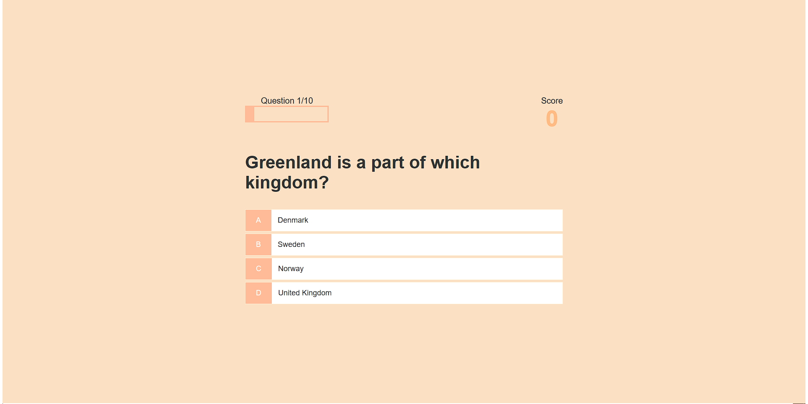

# [Quiz-App](https://mshabunin97.github.io/Quiz-App/)

;

Quiz App - это простое и интерактивное веб-приложение, которое позволяет вам играть в увлекательную викторину с разнообразными вопросами. Проходите через серию вопросов, выбирайте правильные ответы и набирайте очки. 

## Особенности 
* Играйте в увлекательную викторину с разнообразными вопросами из различных областей знаний.
* Выбирайте правильные варианты ответов и набирайте очки для повышения своего счета.
* Получайте мгновенную обратную связь о правильности выбранных ответов.
* Отслеживайте свой прогресс и результаты, а также сравнивайте их с другими игроками.
* Простой и интуитивно понятный пользовательский интерфейс для удобного пользования.

## Технологии

## Ссылки проекта

Ссылка на проект для просмотра - https://mshabunin97.github.io/Quiz-App/

